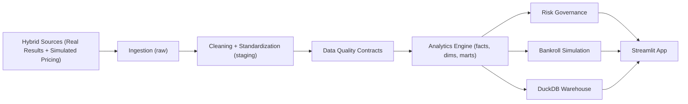

# Sports Betting Intelligence Engine

[](https://www.python.org/)
[](#)
[](LICENSE)

End-to-end analytics pipeline that evaluates sports betting strategy performance with a focus on **profit quality** — not just raw returns, but CLV discipline, drawdown behavior, concentration risk, and capital preservation.

Built as a data product: ingestion, cleaning, validation, mart materialization, risk scoring, bankroll simulation, and a Streamlit dashboard — all running locally with reproducible sample data.

## How to Run

### Makefile (Linux/macOS)
```bash
make install
make seed
make pipeline
make test
make app
```

### Plain commands
```bash
python -m pip install -e ".[dev]"
python -m src.main seed --matches 500 --seed 42
python -m src.main pipeline
python -m pytest
python -m streamlit run app/Home.py
```

### Windows (PowerShell)
```powershell
.\run.ps1 setup
.\run.ps1 seed -Matches 500 -Seed 42
.\run.ps1 pipeline
.\run.ps1 test
.\run.ps1 app
```

## Architecture



## Data

Uses a hybrid demo dataset: real football match results (Premier League, La Liga, Serie A, Bundesliga — 2024/2025 season) combined with simulated odds, stakes, and picks. This keeps the pipeline reproducible and offline while grounding match context in real outcomes.

Source details: [`docs/data_sources.md`](docs/data_sources.md)

## Key Metrics

ROI, yield, CLV, profit factor, expectancy, max drawdown, Sharpe-like ratio, win/loss streaks, bankroll volatility — segmented by strategy, market, league, bookmaker, odds band, and period.

Formula details: [`docs/metrics.md`](docs/metrics.md)

## Screenshots

Captured using the **Português** interface mode.

### Home


### Overview


### Strategy Analysis


### CLV Analysis


### Risk Governance


### Bankroll Simulation


### Market Performance & Data Quality


## Project Structure

```text
sports-betting/
|- data/                 # raw, staging, marts, samples
|- docs/                 # architecture, metrics, governance, case study
|- sql/                  # ddl, staging models, marts, exploratory queries
|- src/                  # ingestion, cleaning, validation, analytics, risk, simulation
|- app/                  # streamlit multipage interface
|- tests/                # automated tests
`- .github/workflows/    # ci and lint pipelines
```

## Language Support

The Streamlit app supports **English** and **Português** via a sidebar selector. Labels, KPI cards, chart titles, table headers, and numeric formatting adapt to the selected language.

## Documentation

- [Architecture](docs/architecture.md)
- [Data sources](docs/data_sources.md)
- [Metrics and formulas](docs/metrics.md)
- [Risk governance](docs/risk_governance.md)
- [Data dictionary](docs/data_dictionary.md)
- [Methodology](docs/methodology.md)
- [Case study](docs/case_study.md)
- [Assumptions and limitations](docs/assumptions_limitations.md)

## Roadmap

- Real API connectors for odds and match events
- Uncertainty intervals and bootstrap confidence bands
- Cross-strategy correlation-aware exposure limits

## Disclaimer

Analytical and educational project. Not financial or betting advice. The risk governance layer highlights volatility, uncertainty, and capital preservation concerns by design.
