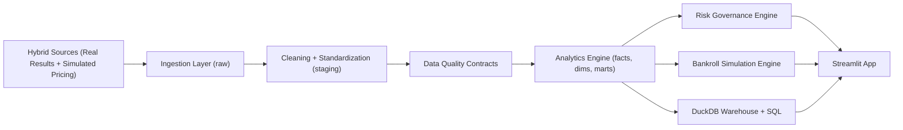
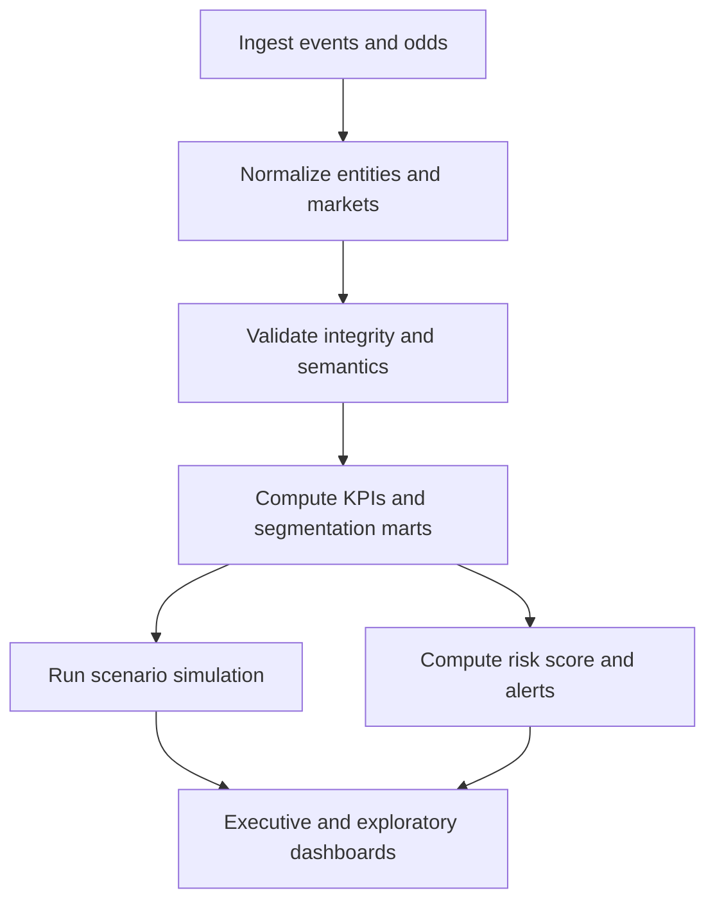
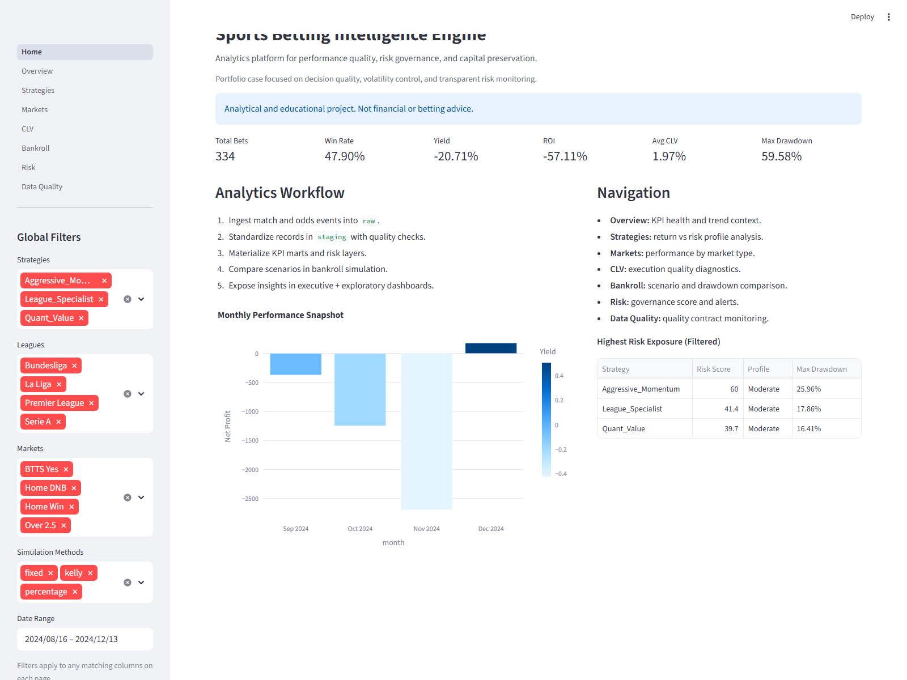
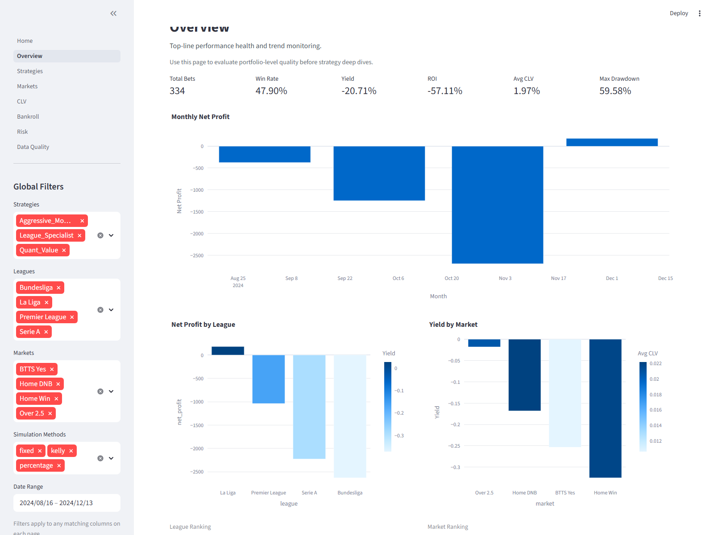
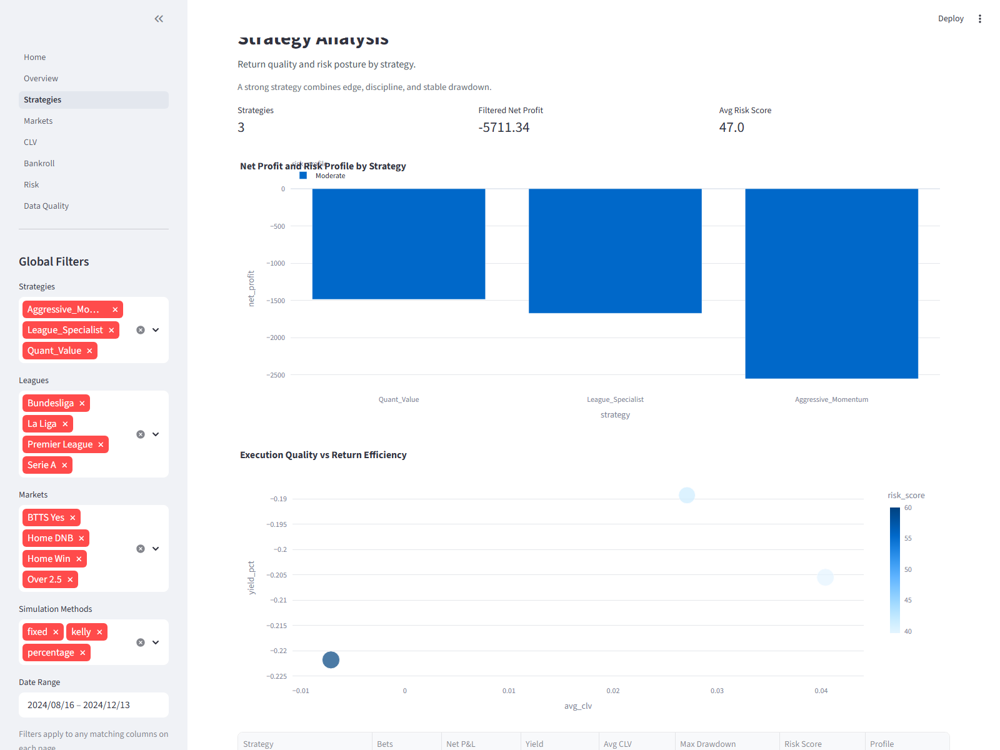
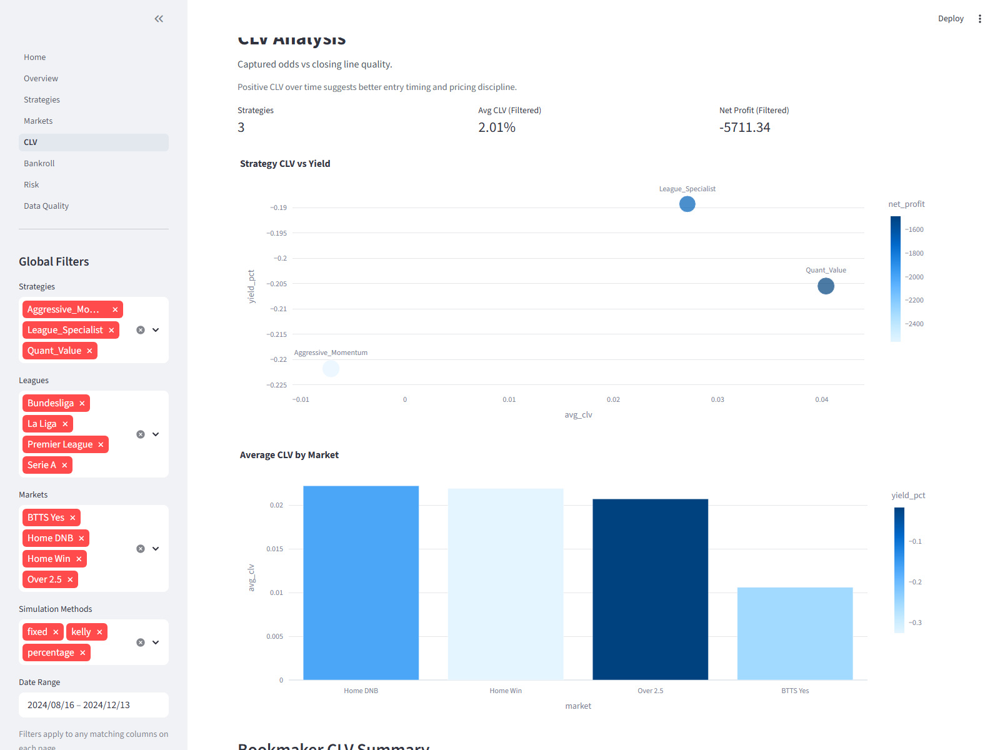
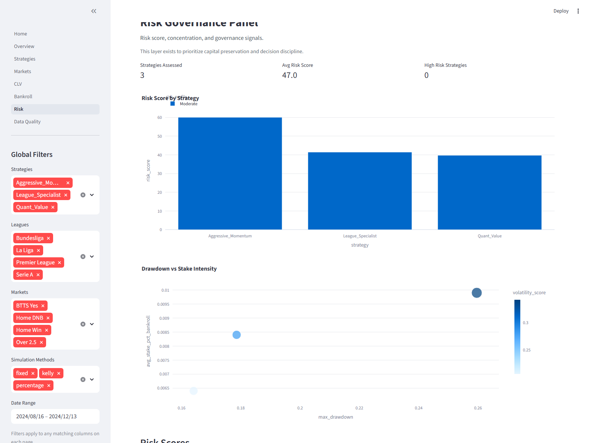
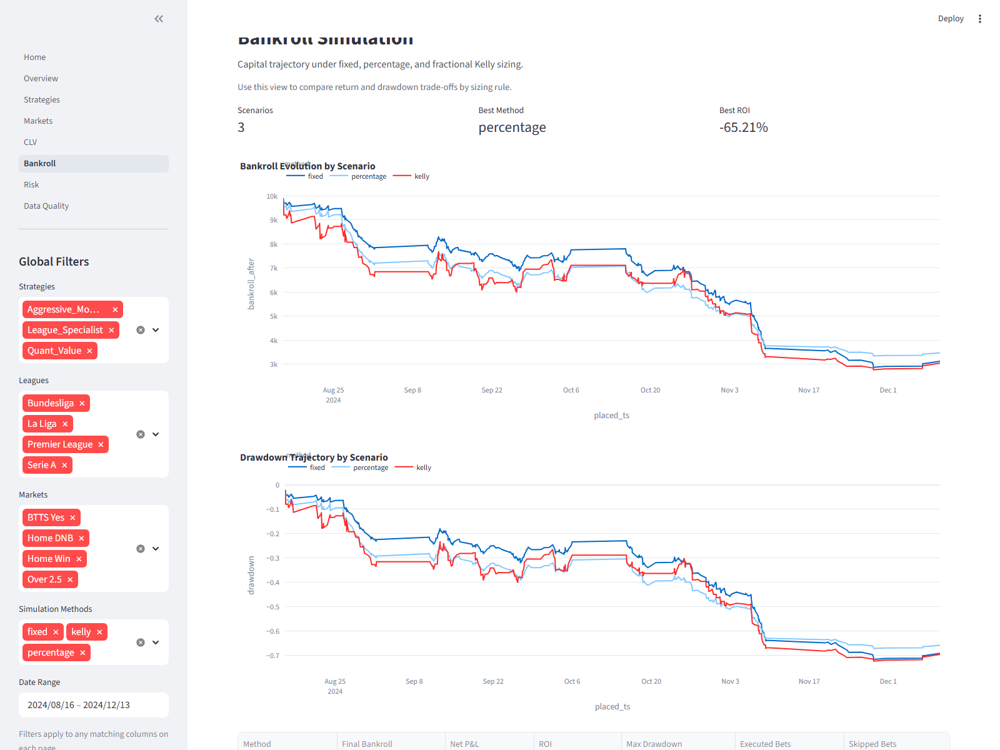
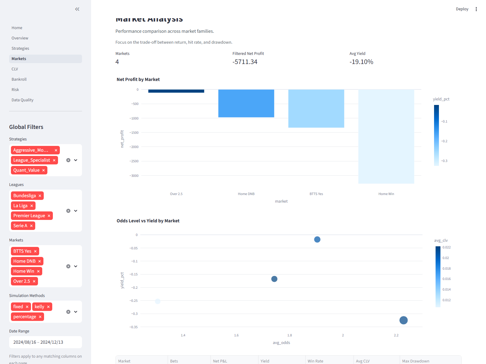
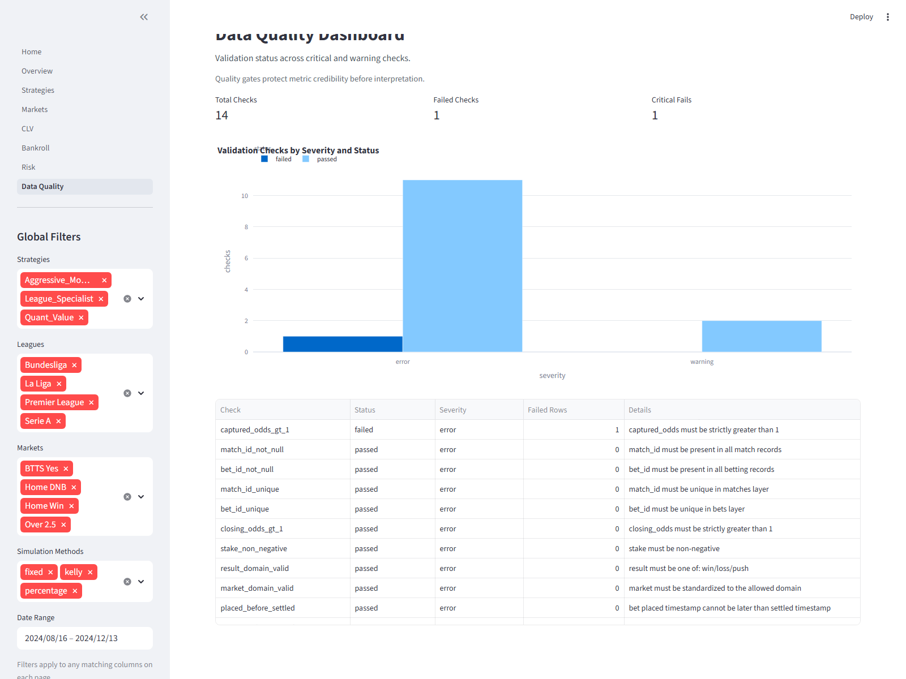

# Sports Betting Intelligence Engine
### Analytics Platform for Strategy Performance, Risk Governance, and Capital Preservation

[](https://www.python.org/)
[](#)
[](LICENSE)

## Opening Hook
Most sports strategy discussions focus on profit. Good analytics teams focus on **profit quality**: edge sustainability, execution quality (CLV), risk concentration, and drawdown behavior.

This project turns fragmented match, odds, and pick records into a clean analytics product for performance review and risk control.

## Business Problem
Organizations that analyze sports markets need to answer:
- Do current strategies show statistically sustainable edge?
- Is positive return driven by process quality or short-term variance?
- Are exposure limits, drawdown rules, and volatility controls being respected?
- Which strategies look profitable but violate governance standards?

Without a trusted analytics layer, decisions become noisy and reactive.

## Why This Project Matters
- Covers the full lifecycle: ingestion, modeling, validation, simulation, and dashboarding.
- Keeps performance metrics tied to explicit governance rules.
- Uses practical analytics engineering patterns (`raw -> staging -> marts`).
- Emphasizes interpretation and uncertainty instead of hype.
- Runs locally with sample data, so reviewers can test it quickly.

## Data Credibility (Hybrid Demo Dataset)
- Uses a local snapshot of real football match results in `data/samples/real_matches_reference.csv`.
- Keeps odds, stake sizing, and picks generated in a controlled way for repeatable analytics tests.
- Preserves offline execution while making match context more realistic for portfolio review.
- Source details: [`docs/data_sources.md`](docs/data_sources.md)

## Architecture


## Analytics Workflow


## Key Metrics Covered
- Total bets analyzed
- Win/loss/push rates
- Net profit
- ROI (capital-based)
- Yield (stake efficiency)
- Average stake and average odds
- Profit factor
- Expectancy
- Closing Line Value (CLV)
- Maximum drawdown
- Max red/green streak
- Bankroll volatility
- Sharpe-like ratio
- Segmentation by strategy, market, league, bookmaker, odds band, and period

Formula details: [`docs/metrics.md`](docs/metrics.md)

## Business Questions This Project Answers
- Which strategy delivered the best risk-adjusted outcome?
- Which market types behave with higher volatility?
- Is average CLV positive and consistent?
- Did higher odds bands increase drawdown risk?
- Which strategies look profitable but operationally fragile?
- Is exposure concentrated in specific leagues or market families?
- How does bankroll behavior change under fixed stake vs Kelly?

## Portfolio Highlights
- End-to-end pipeline with modular Python code
- Layered data model (`raw`, `staging`, `marts`) + DuckDB warehouse
- Risk governance module with score, profile, and alerts
- Bankroll simulation with multiple sizing rules
- SQL assets for DDL, marts, and exploratory analysis
- Multipage Streamlit app with global filters
- Data quality checks and automated tests
- CI workflows for lint and tests

## Documentation Index
- Architecture: [`docs/architecture.md`](docs/architecture.md)
- Data sources: [`docs/data_sources.md`](docs/data_sources.md)
- Metrics and formulas: [`docs/metrics.md`](docs/metrics.md)
- Risk governance policy: [`docs/risk_governance.md`](docs/risk_governance.md)
- Data dictionary: [`docs/data_dictionary.md`](docs/data_dictionary.md)
- Case study narrative: [`docs/case_study.md`](docs/case_study.md)
- Recruiter summary: [`docs/recruiter_summary.md`](docs/recruiter_summary.md)
- LinkedIn ready posts: [`docs/linkedin_post_examples.md`](docs/linkedin_post_examples.md)
- Publishing and release plan: [`docs/publishing_and_releases.md`](docs/publishing_and_releases.md)

## Screenshots
### Home hero


### Overview dashboard


### Strategy performance


### CLV analysis


### Risk governance


### Bankroll scenarios


### Additional views



Capture guide: [`docs/screenshots/README.md`](docs/screenshots/README.md)

## How To Run
### Option A: Makefile
Use this option when `make` is available (Linux/macOS or Windows with Make installed).

```bash
make install
make seed
make pipeline
make test
make app
```

### Option B: Plain commands
```bash
python -m pip install -e ".[dev]"
python -m src.main seed --matches 280 --seed 42
python -m src.main pipeline
python -m pytest
python -m streamlit run app/Home.py
```

### Option C: Windows helper script
```powershell
.\run.ps1 setup
.\run.ps1 seed -Matches 280 -Seed 42
.\run.ps1 pipeline
.\run.ps1 test
.\run.ps1 app
```

## Project Structure
```text
sports-betting/
|- data/                 # raw, staging, marts, samples
|- docs/                 # architecture, metrics, governance, case study
|- sql/                  # ddl, staging models, marts, exploratory queries
|- src/                  # ingestion, cleaning, validation, analytics, risk, simulation
|- app/                  # streamlit multipage interface
|- tests/                # automated tests for critical logic
`- .github/workflows/    # ci and lint pipelines
```

## What This Project Demonstrates
For **Data Analyst / BI Analyst**:
- KPI design, segmentation logic, and business storytelling
- Dashboard clarity with executive and exploratory lenses

For **Analytics Engineer**:
- Analytical modeling, data contracts, mart materialization, SQL assets

For **Junior Data Engineer**:
- Reproducible pipelines, modular architecture, validation layer, CI discipline

For **Product/Data Analytics**:
- Risk-aware metric interpretation and decision-oriented framing

## Roadmap
- Add real API connectors for odds snapshots and match events
- Add dbt models/tests and lineage docs
- Add uncertainty intervals and bootstrap confidence bands
- Add cross-strategy correlation-aware exposure limits
- Publish cloud deployment profiles (Streamlit Cloud + containerized options)

## Responsible Use Disclaimer
This project is intended for analytical, educational, and portfolio purposes only.  
It does not constitute financial advice, betting advice, or encouragement of gambling activity.  
The risk governance layer exists precisely to highlight volatility, uncertainty, and capital preservation concerns.
